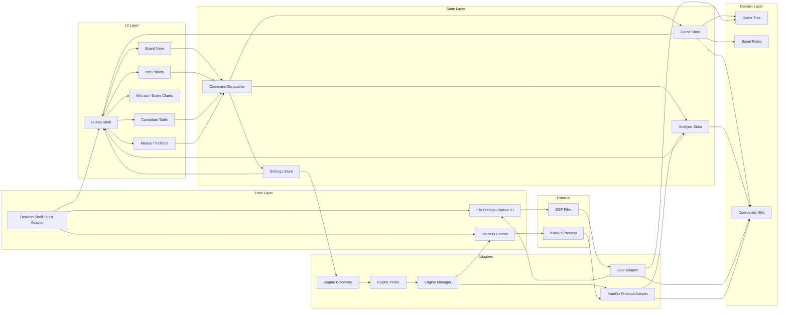
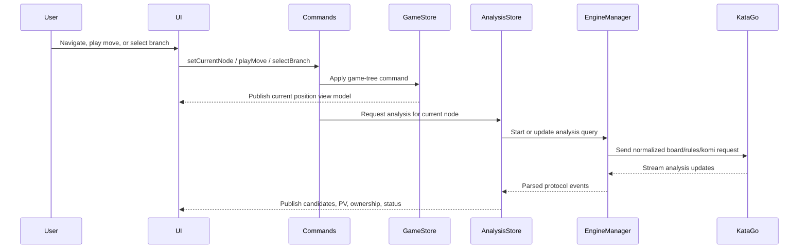
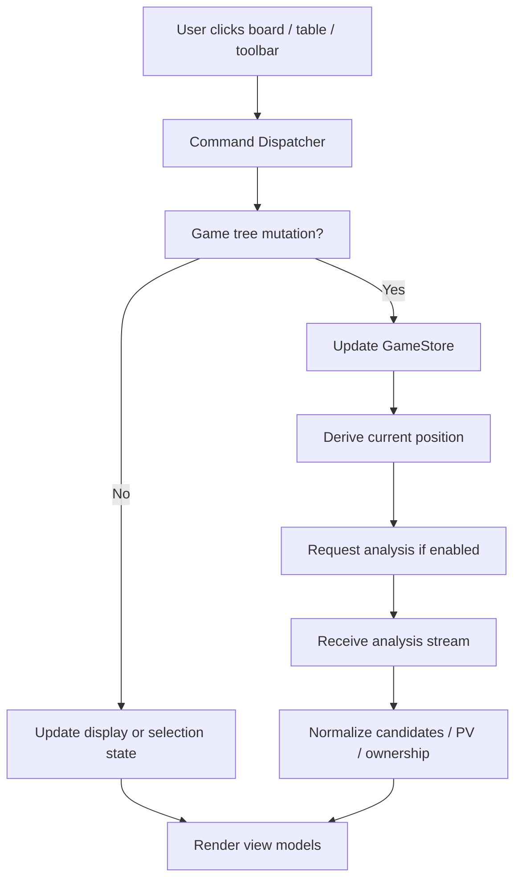
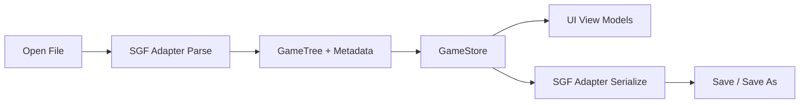

# TensuGo System Architecture

## Table of Contents

- System module diagram
- Core state ownership
- Current-node analysis flow
- User interaction flow
- Persistence flow
- Module boundaries
- Implementation sequence
- Architecture risks

## System Module Diagram

## Core State Ownership

- `GameStore` owns the loaded game, current node, branch selection, metadata, and mutation commands.
- `AnalysisStore` owns live engine output, normalized candidates, current PV preview, ownership, and per-node cached analysis.
- `SettingsStore` owns engine profiles, selected engine, display preferences, limits, and feature flags.
- `EngineDiscovery` and `EngineProbe` help normal users create valid engine profiles automatically while preserving manual advanced configuration.
- Board and panels render derived view models from stores; they should not mutate domain objects directly.

## Current-Node Analysis Flow

## User Interaction Flow

## Persistence Flow

## Module Boundaries

### UI Layer

- May dispatch commands.
- May render view models from stores.
- Must not parse SGF.
- Must not parse raw KataGo protocol output.
- Must not implement coordinate conversion locally.

### Domain Layer

- Owns game-tree shape, board position derivation, legal/capture behavior when needed, and coordinates.
- Must remain UI-agnostic.
- Should be testable without launching the app shell or KataGo.

### Engine Layer

- Owns process lifecycle, protocol IO, request cancellation/replacement, and parsing.
- Owns automatic engine discovery/probing and converts setup failures into readable diagnostics.
- Must cover common local KataGo setup cases by default, while keeping a manual command-line escape hatch.
- Emits normalized analysis events to `AnalysisStore`.
- Does not know about panels, canvas, or visual styling.

### SGF Layer

- Converts between files and domain game trees.
- Preserves unknown properties when practical.
- Maps komi, player names, board size, handicap, comments, and branches.
- Does not trigger engine analysis directly.

### Analysis Store

- Merges live engine events into current-node analysis.
- Stores cached analysis by stable node/position key.
- Handles stale updates when user navigates before an engine response arrives.
- Exposes UI-ready candidate, chart, PV, ownership, and status view models.

## Implementation Sequence

1. Create project skeleton and static shell.
2. Build responsive main layout with placeholder stores.
3. Implement board coordinate utilities and board renderer.
4. Implement `GameTree`, current-node navigation, and branch basics.
5. Add SGF parse/save.
6. Add engine profile model and process manager.
7. Add engine discovery/probe and setup diagnostics.
8. Add KataGo analysis request/stream parser.
9. Wire normalized candidates into board and candidate table.
10. Add PV hover preview and ownership overlay.
11. Add winrate/score chart and cached node analysis.
12. Add edit commands and engine settings UI.

## Architecture Risks

- Raw engine output leaking into UI components makes future protocol changes painful.
- Treating move lists as flat arrays will break branches and main-line promotion.
- Caching analysis by move number alone will corrupt branch analysis.
- Multiple coordinate conversion implementations will create off-by-one and pass-move bugs.
- Rendering ownership too early without normalized board-size mapping will make UI state fragile.
- Overbuilding dropped legacy features will slow MVP and clutter the shell.
- Making manual command-line setup the primary engine workflow will reproduce the legacy product's onboarding pain.
