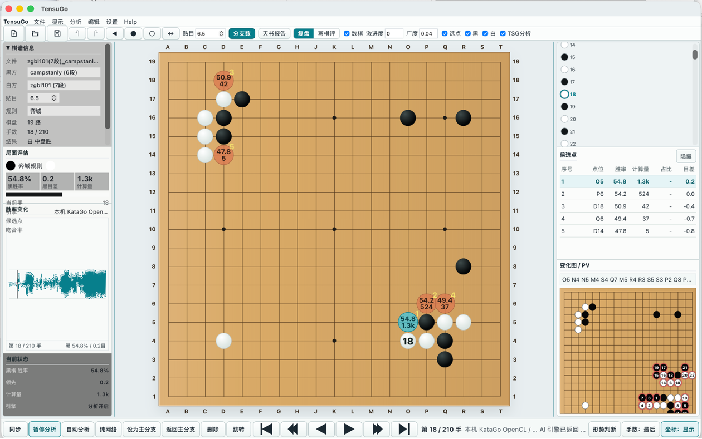

# TensuGo

TensuGo is a Tauri desktop application for reviewing Weiqi/Go games with KataGo analysis.

The app uses a React + TypeScript frontend and a Rust/Tauri backend. The frontend renders the board, SGF/research workflow, candidate moves, review graph, and settings UI. The backend owns native filesystem access, platform paths, local KataGo process management, and bundled resource discovery.



## Current Status

TensuGo is under active development. macOS is the primary tested platform today. The codebase has been prepared for Windows builds with platform isolation, but Windows packaging and native file dialogs still need real-machine validation. iOS and Android have explicit platform entries, but local KataGo execution is currently marked unsupported on mobile.

## Features

- Empty-board startup for manual review.
- SGF import and game-tree navigation.
- Branch and variation editing.
- KataGo candidate move display with winrate, score lead, visits, and PV.
- Automatic analysis workflow and Eagle Eye-style report data.
- Research document mode with board snapshots, candidate blocks, and variation commentary.
- PDF / HTML research export.
- Engine settings for auto-detecting, choosing, testing, and resetting KataGo configuration.

## Project Layout

```text
src/
  app/                 Main React app shell
  board/               Go board rendering
  components/          Toolbars, dialogs, panels, settings UI
  engine/              Frontend engine API wrappers
  game/                Board rules and game tree helpers
  platform/            Frontend platform adapters
  research/            Research document model and rendering
  sgf/                 SGF parsing
  stores/              App state stores

src-tauri/
  src/
    lib.rs             Tauri commands and native orchestration
    engine_discovery.rs
    platform/          Rust platform isolation layer
      mod.rs
      common.rs
      macos.rs
      windows.rs
      mobile.rs
      desktop_other.rs
  resources/katago/    Reserved bundled KataGo resource layout
```

## Requirements

- Node.js and npm.
- Rust toolchain.
- Tauri prerequisites for your target platform.
- KataGo executable, model, and GTP config file for local AI analysis.

Browser preview can run without KataGo, but native engine analysis requires the Tauri app because it starts a local process.

## Development

Install dependencies:

```bash
npm install
```

Run frontend browser preview:

```bash
npm run dev
```

Run the desktop app in Tauri dev mode:

```bash
npm run tauri
```

Build the frontend:

```bash
npm run build
```

Check the Rust/Tauri backend:

```bash
cargo check --manifest-path src-tauri/Cargo.toml
```

Run Rust tests:

```bash
cargo test --manifest-path src-tauri/Cargo.toml
```

## Packaging

macOS packaging script:

```bash
npm run package:mac
```

This bumps the app version, runs the Tauri build, and labels the generated macOS artifact for testing.

Install the generated macOS app locally:

```bash
npm run install:mac
```

Windows packaging is structurally prepared, but should be validated on a Windows machine before release.

## KataGo Engine Configuration

Open `设置 -> 引擎` in the app.

Available actions:

- `Auto Detect`: searches for a usable engine profile.
- `Choose Engine`: selects the KataGo executable.
- `Choose Model`: selects the model file.
- `Choose Config`: selects the GTP config file.
- `Test Engine`: runs `katago version`, then starts GTP with the selected model/config and waits for `GTP ready`.
- `Reset to Default`: clears the saved user profile and returns to auto-detection.

Detection priority:

1. User configuration.
2. Bundled engine resources.
3. Common platform install directories.
4. `PATH`.
5. Dev environment candidates in debug builds.

Runtime files are created under Tauri's official app data directory, not a hard-coded user path.

## Bundled KataGo Resources

Future release bundles can place KataGo resources under:

```text
src-tauri/resources/katago/
  katago            # macOS/Linux executable, or katago.exe on Windows
  configs/
    default_gtp.cfg
  models/
    model.bin.gz
```

Large binaries and model files are ignored by Git. Add them only in local packaging workspaces or release build jobs.

## Platform Isolation

Frontend platform adapters live in `src/platform/`.

Rust platform logic lives in `src-tauri/src/platform/`:

- macOS paths and AppleScript dialogs: `macos.rs`
- Windows install candidates and executable naming: `windows.rs`
- iOS / Android unsupported local engine entry: `mobile.rs`
- shared Tauri app directory/resource helpers: `common.rs`

Common engine discovery calls only the unified platform interface, so business logic does not spread platform-specific branches across the codebase.

## Verification Checklist

Before considering a change ready:

```bash
npm run build
cargo fmt --manifest-path src-tauri/Cargo.toml --check
cargo check --manifest-path src-tauri/Cargo.toml
cargo test --manifest-path src-tauri/Cargo.toml
```

For engine work, also use `设置 -> 引擎 -> Test Engine` with a real KataGo executable, model, and config file.

## More Documentation

- [Code Structure](Docs/Code-Structure.md)
- [KataGo Engine Configuration Guide](Docs/KataGo-Engine-Configuration-Guide.md)
- [KataGo Troubleshooting](Docs/KataGo-Troubleshooting.md)
- [Release v0.1 Scope](Docs/Release-v0.1.md)
- [BRG Design](Docs/BRG-Design-1.0.md)
